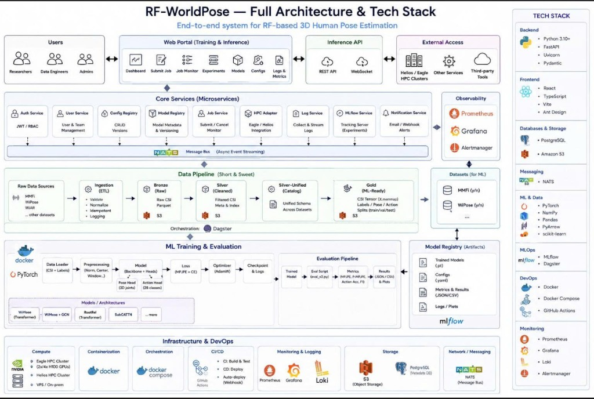

<div align="center">

# RF-WorldPose

**WiFi CSI → 3D human pose & action recognition**

End-to-end research platform: ESP32 CSI capture → Bronze/Silver/Gold data lake → PyTorch training on HPC → MLflow experiment tracking → API & ONNX inference.

[Quick Start](#quick-start) · [Models](#models--training-presets) · [Results](#benchmark-snapshot) · [API](#api--services) · [Docs](#documentation)

<br>

[](ml/pyproject.toml)
[](ml/pyproject.toml)
[](infra/docker-compose/docker-compose.yml)
[](.github/workflows/ci.yml)

</div>

---

## Table of Contents

- [Overview](#overview)
- [Benchmark Snapshot](#benchmark-snapshot)
- [Features](#features)
- [Architecture](#architecture)
- [Quick Start](#quick-start)
- [Models & Training Presets](#models--training-presets)
- [Evaluation & Figures](#evaluation--figures)
- [API & Services](#api--services)
- [Project Structure](#project-structure)
- [Development](#development)
- [Troubleshooting](#troubleshooting)
- [Documentation](#documentation)
- [Contributing](#contributing)

---

## Overview

**RF-WorldPose** estimates **3D body pose** and **activity labels** from **WiFi Channel State Information (CSI)** — no camera required at inference time. The repository is both a **research codebase** (multiple model families, ablations, thesis artifacts) and a **platform skeleton** (data ETL, HPC job submission, control-plane API, inference service).

**Current research takeaway** (protocol-specific — do not mix numbers blindly):

| Goal | Recommended pipeline | Notes |
|------|---------------------|--------|
| **Pose (MM-Fi)** | `wimose_mmfi17j_proto1_eagle` — **WiMoseNet Proto1** | Single-task CNN; best held-out test on Protocol 1 |
| **Action** | `rootrel_mmfi_eagle` — **CSITransformerPoseRootRel** | Multitask Transformer on `unified-v2`; ~91% accuracy |
| **Pretraining** | `ssl_eagle` / MAE experiments | Encoder init for Transformer family |

Training presets are registered in **`eagle_runner/rfpose_eagle/registry.py`** — the single source of truth for submit scripts and the API.

---

## Benchmark Snapshot

Numbers below come from held-out evaluation on Eagle (MM-Fi Protocol 1 / unified-v2). See [`docs/research-log-30d-2026-05-14_to_2026-06-13.md`](docs/research-log-30d-2026-05-14_to_2026-06-13.md) for full experiment history.

### Pose (MPJPE ↓)

| Model | Split | *N* | MPJPE | PA-MPJPE | Protocol |
|-------|------:|----:|------:|---------:|----------|
| **WiMose Proto1** | val | 1,500 | **157.3 mm** | 147.5 mm | MM-Fi Protocol 1 |
| **WiMose Proto1** | test | 1,104 | **173.6 mm** | 157.1 mm | MM-Fi Protocol 1 |
| RootRel | val | 1,296 | 306.6 mm | 216.4 mm | unified-v2 |
| RootRel | test | 1,296 | 310.5 mm | 216.3 mm | unified-v2 |

### Action (accuracy ↑)

| Model | Split | Accuracy | Macro-F1 | Protocol |
|-------|------:|---------:|---------:|----------|
| **RootRel multitask** | val | **91.28%** | 90.95% | unified-v2 |
| **RootRel multitask** | test | **91.51%** | 91.37% | unified-v2 |
| WiMose action head (Proto1) | val | ~18–19% | low | ≈ majority baseline |

> **WiMose Proto1** is the strongest **pose** model under MM-Fi Protocol 1. **RootRel** is the strongest **action** model on unified-v2. Proto1 action fine-tuning (frozen backbone) has not beaten the majority class.

---

## Features

- **Multi-model training** — WiMoseNet (CNN), CSITransformerPoseRootRel, CSIViT2D, SSL/MAE pretraining, GCN/FK ablations
- **Gold NPZ datasets** — structured CSI windows, pose/action labels, train/val/test splits, CSI & pose normalization
- **HPC integration** — Slurm jobs on Eagle via `eagle_runner` + `scripts/eagle_submit_train.sh`
- **MLOps** — MLflow metrics, checkpoints, artifact tracking
- **Control-plane API** — job registry, HPC submit/refresh/cancel, dataset & model metadata
- **Inference service** — ONNX runtime, NATS realtime stream, pose + action outputs
- **Reproducible eval** — Slurm eval jobs, JSON metrics, visualization scripts

---

## Architecture

<p align="center">
  <a href="docs/images/rf-worldpose-architecture.png">
    
  </a>
  <br/>
  <sub><b>RF-WorldPose — Full Architecture &amp; Tech Stack</b> · RF-based 3D human pose estimation end-to-end</sub>
</p>

The platform spans **edge capture → medallion data lake → HPC training → MLOps → serving**:

| Block | Components |
|-------|------------|
| **Users & access** | Web portal (dashboard, jobs, experiments, models), REST/WebSocket inference API |
| **Core services** | Auth, config/model registry, job service, HPC adapter (Eagle/Helios), MLflow, logs — via **NATS** message bus |
| **Data pipeline** | Dagster ETL: Raw (MM-Fi, WiPose, WiAR) → **Bronze** (Parquet/S3) → **Silver** → **Silver-Unified** → **Gold** (`X.memmap`, pose/action labels, train/val/test) |
| **ML training** | PyTorch on Eagle H100: loader → preprocess → backbone + pose/action heads → MPJPE + CE → AdamW → checkpoints |
| **Evaluation** | `eval_v2.py` → MPJPE, PA-MPJPE, action accuracy/F1 → JSON/CSV + plots → MLflow artifacts |
| **Infrastructure** | Docker Compose, GitHub Actions CI/CD, Prometheus + Grafana + Loki, PostgreSQL + S3/MinIO |

### Tech stack

| Area | Technologies |
|------|--------------|
| Backend | Python 3.11+, FastAPI, Uvicorn, Pydantic |
| Frontend | React, TypeScript, Vite, Ant Design |
| Data & ML | PyTorch, NumPy, Pandas, PyArrow, scikit-learn, Hydra |
| MLOps | MLflow, Dagster |
| Messaging & storage | NATS, PostgreSQL, S3/MinIO |
| DevOps & observability | Docker, Docker Compose, GitHub Actions, Prometheus, Grafana |

### Repository map

| Layer | Path | Role |
|-------|------|------|
| ML core | [`ml/rfpose/`](ml/rfpose/) | Models, training, evaluation |
| Configs | [`ml/configs/`](ml/configs/) | Hydra YAML experiment configs |
| HPC registry | [`eagle_runner/rfpose_eagle/registry.py`](eagle_runner/rfpose_eagle/registry.py) | Canonical training presets |
| Submit | [`scripts/eagle_submit_train.sh`](scripts/eagle_submit_train.sh) | Render sbatch & submit to Eagle |
| ETL | [`pipelines/`](pipelines/) | Dagster Bronze → Silver → Gold |
| API | [`services/api/`](services/api/) | FastAPI control plane |
| Inference | [`services/inference/`](services/inference/) | ONNX + NATS inference |
| Firmware | [`firmware/`](firmware/) | ESP32-S3 CSI node |
| Infra | [`infra/docker-compose/`](infra/docker-compose/) | Local dev stack |

---

## Quick Start

### Prerequisites

- **Python 3.11+**
- **Docker** & **Docker Compose**
- **SSH** to Eagle HPC (for remote training)
- Optional: **CUDA** for local ML smoke tests

### 1. Clone & configure

```bash
git clone https://github.com/tientruongminh/rf-worldpose.git
cd rf-worldpose
cp .env.example .env   # edit secrets if needed
```

### 2. Start local platform

```bash
./scripts/dev_up.sh
# or: make up
```

| Service | URL |
|---------|-----|
| API (Swagger) | http://localhost:8080/docs |
| MLflow | http://localhost:5000 |
| MinIO console | http://localhost:9003 |
| Dagster | http://localhost:3004 |
| Grafana | http://localhost:3002 |

Stop: `make down` · Reset volumes: `docker compose -f infra/docker-compose/docker-compose.yml --env-file .env down -v`

### 3. Install ML package (optional, for local runs)

```bash
cd ml && pip install -e .
```

### 4. Submit your first training job (Eagle)

```bash
# Default: WiMose Proto1 pose (recommended)
./scripts/eagle_submit_train.sh

# Dry-run: render sbatch only
DRY_RUN=1 ./scripts/eagle_submit_train.sh

# List all registered presets
LIST_CONFIGS=1 ./scripts/eagle_submit_train.sh
```

---

## Models & Training Presets

Add or change presets in **`eagle_runner/rfpose_eagle/registry.py`**, then add matching Hydra YAML under **`ml/configs/`**.

| Config | Family | Task | Train module | Dataset |
|--------|--------|------|--------------|---------|
| `wimose_mmfi17j_proto1_eagle` ⭐ | WiMoseNet | pose | `train_wimose` | humanlike Proto1 |
| `rootrel_mmfi_eagle` | RootRel Transformer | multitask | `train_v2` | unified-v2 |
| `rootrel_mmfi_pose_only_eagle` | RootRel | pose | `train_v2` | unified-v2 |
| `rootrel_mmfi_action_only_from_scratch_eagle` | RootRel | action | `train_v2` | unified-v2 |
| `vit2d_mmfi_eagle` | CSIViT2D | pose | `train_vit2d` | unified-v2 |
| `ssl_eagle` | SSL CNN | pretrain | `ssl_pretrain` | unified-v2 |
| `quick_test` | smoke | smoke | `transformer_train` | unified-v2 |

### Common submit environment variables

| Variable | Default | Description |
|----------|---------|-------------|
| `CONFIG` | `wimose_mmfi17j_proto1_eagle` | Registered preset name |
| `JOB_ID` | auto `rfpose-*` | Run / checkpoint id |
| `DRY_RUN` | `0` | Render sbatch without submitting |
| `SMOKE` | `0` | Short smoke-test preset |
| `SKIP_DATA` | `0` | Skip gold data rsync |
| `GPUS` / `CPUS` / `MEM` / `TIME_LIMIT` | preset defaults | Slurm resources |

### Examples

```bash
# RootRel multitask (pose + action)
CONFIG=rootrel_mmfi_eagle ./scripts/eagle_submit_train.sh

# RootRel action-only from scratch
CONFIG=rootrel_mmfi_action_only_from_scratch_eagle ./scripts/eagle_submit_train.sh

# ViT2D baseline
CONFIG=vit2d_mmfi_eagle ./scripts/eagle_submit_train.sh

# Smoke test
SMOKE=1 CONFIG=quick_test ./scripts/eagle_submit_train.sh
```

---

## Evaluation & Figures

Run evaluation on Eagle after training (checkpoint + Gold NPZ on the cluster):

```bash
# WiMose action eval (Proto1)
sbatch scripts/eval_wimose_action_test.sbatch

# WiMose action-only head eval
sbatch scripts/eval_wimose_action_only_test.sbatch

# Registered eval wrapper preset
CONFIG=eval_demo ./scripts/eagle_submit_train.sh
```

Pose visualization (on Eagle workspace with checkpoint + dataset):

```bash
python scripts/viz_mmfi17j_best.py --checkpoint /path/to/best.pt --out viz_output/mmfi17j_best
python scripts/viz_wimose_best_eda_overlay.py   # EDA overlay plots
```

Metrics are logged to **MLflow** during training. Export curves from the MLflow UI or query the tracking API. Thesis/report figures live under `docs/thesis/figures/` when generated.

---

## API & Services

### List training presets

```bash
curl http://localhost:8080/api/v1/hpc/configs
```

### Create job → dry-run → submit

```bash
curl -X POST http://localhost:8080/api/v1/training-jobs \
  -H 'Content-Type: application/json' \
  -d '{
    "id": "wimose-proto1-run",
    "dataset_version": "rfpose-humanlike-v2-proto1",
    "train_config": "wimose_mmfi17j_proto1_eagle",
    "submitted_by": "researcher"
  }'

curl -X POST 'http://localhost:8080/api/v1/hpc/training-jobs/wimose-proto1-run/submit?dry_run=true'
curl -X POST http://localhost:8080/api/v1/hpc/training-jobs/wimose-proto1-run/submit
```

### Inference service

Loads `$MODEL_DIR/model.onnx`. Key endpoints: `GET /health`, `GET /status`, `POST /predict`, `POST /reload`.

```json
{
  "csi": [[[0.1, 0.2], [0.3, 0.4]]]
}
```

Returns `action` logits and `pose_3d` / `pose_2d` when the exported ONNX head supports them.

---

## Project Structure

```text
rf-worldpose/
├── ml/                    # PyTorch models, configs, training, eval
│   ├── configs/           # Hydra YAML
│   └── rfpose/
├── eagle_runner/          # HPC preset registry + Slurm submit
├── scripts/               # dev_up, eagle_submit, eval, viz
├── services/
│   ├── api/               # FastAPI control plane
│   └── inference/         # ONNX inference + NATS
├── pipelines/             # Dagster ETL
├── firmware/              # ESP32 CSI node
├── gateway/               # Edge CSI gateway (Rust)
├── infra/docker-compose/  # Local dev stack
├── docs/                  # Architecture, API, research logs
└── notebooks/             # Exploratory analysis
```

---

## Development

```bash
# Compile-check Python packages
python -m compileall eagle_runner services/api/src services/inference/src ml/rfpose

# API tests
PYTHONPATH=services/api/src:eagle_runner pytest services/api/tests

# Validate compose config
cd infra/docker-compose && docker compose config --quiet
```

CI runs on push/PR to `main` and `develop` (see [`.github/workflows/ci.yml`](.github/workflows/ci.yml)).

---

## Troubleshooting

| Symptom | Likely cause | What to do |
|---------|--------------|------------|
| Wrong model submitted | Preset not in registry | Update `registry.py` + `ml/configs/` |
| Pose viz collapsed / far away | Coord mismatch | Check `center_pose`, `root_joint`, CSI norm in checkpoint |
| Proto1 action ~18–19% | Majority-class baseline | Use RootRel on unified-v2 for action |
| Slurm FAILED but `best.pt` exists | DDP teardown after train | Evaluate checkpoint before resubmit |
| MLflow job very slow | Per-batch logging | Log metrics per epoch |
| Inference: no model | Missing ONNX | Export to `$MODEL_DIR/model.onnx`, `POST /reload` |

---

## Documentation

| Resource | Path |
|----------|------|
| ML training guide (Vietnamese) | [`ml/README.md`](ml/README.md) |
| System overview (Vietnamese) | [`docs/system-overview-vi.md`](docs/system-overview-vi.md) |
| Architecture | [`docs/architecture.md`](docs/architecture.md) |
| API reference | [`docs/api.md`](docs/api.md) |
| Research log (30 days) | [`docs/research-log-30d-2026-05-14_to_2026-06-13.md`](docs/research-log-30d-2026-05-14_to_2026-06-13.md) |
| Datasets & models | [`docs/datasets-training-model.md`](docs/datasets-training-model.md) |
| ESP32 firmware | [`firmware/esp32-csi-node/README.md`](firmware/esp32-csi-node/README.md) |

---

## Contributing

1. **Register new experiments** in `eagle_runner/rfpose_eagle/registry.py` before adding ad-hoc sbatch scripts.
2. **Keep protocol explicit** in configs, eval JSON, and docs (Proto1 vs unified-v2, joint count, split).
3. **Run compile check** before opening a PR.
4. **Do not commit** secrets, `.env`, large checkpoints, or raw datasets.

```bash
git checkout -b feature/my-experiment
# ... changes ...
python -m compileall ml/rfpose eagle_runner
git commit -m "feat(ml): add my-experiment preset and config"
```

---

## Citation

If you use this codebase in academic work, please cite the project and the underlying datasets (MM-Fi, WiPose, etc.) according to their respective papers. A formal BibTeX entry will be added when the thesis/preprint is published.

---

## License

This repository is an academic research project. License terms are not yet finalized in the root `LICENSE` file — contact the maintainers before commercial use.

---

<div align="center">

**RF-WorldPose** — sensing human motion through the wireless channel.

</div>
